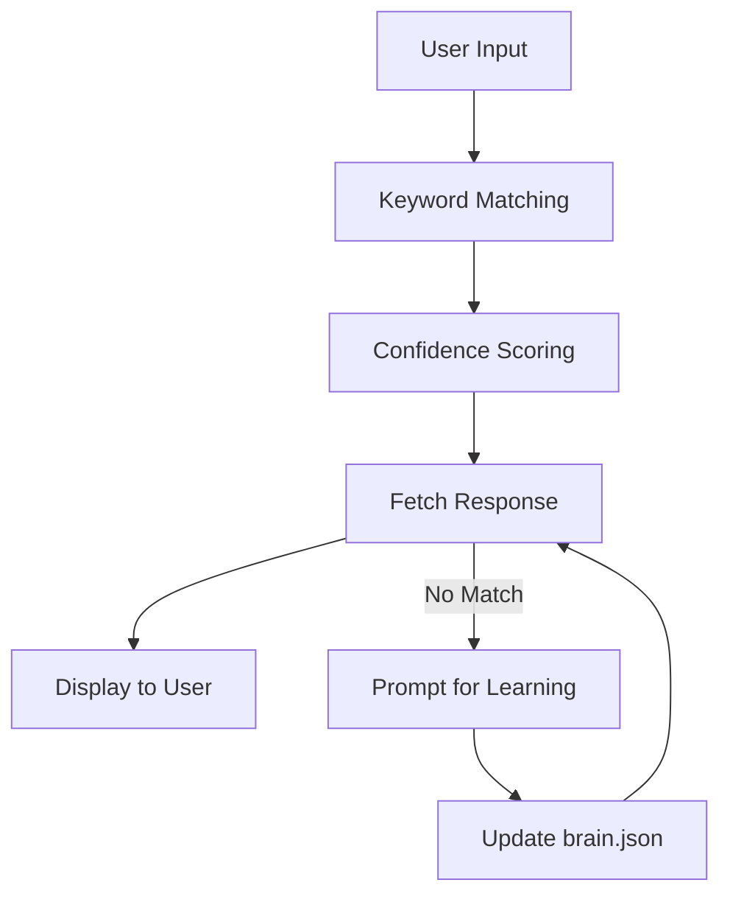

# 🤖 Offline AI Assistant for Termux (No API, No Internet)

This project provides a **fully offline, Python-based AI assistant** designed specifically for Termux on Android. It functions without requiring any internet connection, API keys, or paid services. The assistant is ideal for privacy-conscious users and those with limited connectivity.

---

## 🚀 Features

The Offline AI Assistant includes a rich set of features aimed at flexibility, persistence, and ease of use:

- **Fully Offline Operation**: No API calls, no internet connectivity required.
- **Auto-learning AI Brain**: The assistant can learn new responses and expand its knowledge interactively.
- **Persistent Memory**: All learning is stored in `brain.json`, surviving restarts and Termux sessions.
- **Multiple Keyword Matching**: Understands user queries using several keywords for more robust matching.
- **Confidence Scoring**: Ranks responses based on relevance.
- **Topic-Based Categories**: Organizes knowledge for more accurate answers.
- **Auto-Suggestions**: Recommends possible queries or topics to the user.
- **Menu Animations**: Engaging CLI animations for better user experience.
- **Modular & Expandable Logic**: Easily extendable codebase for custom features or integrations.
- **Legal & Ethical**: 100% offline, transparent, and respectful of privacy and intellectual property.

---

## 📦 Requirements

To run the Offline AI Assistant, ensure you have:

- **Termux** (Android terminal emulator)
- **Python 3.9+**

---

## 🔧 Installation

Set up the assistant in Termux by executing the following commands:

```bash
pkg update && pkg upgrade
pkg install python git -y
git clone https://github.com/techvyana20-oss/IronMan-Jarvis-Offline.git
cd Offline-AI-Termux
python offline_ai.py
```

---

## 🧠 How Offline Learning Works

The core advantage of this assistant is its offline learning capability:

- **Teach the AI once**: Add new Q&A pairs interactively.
- **Knowledge saved**: All learned data is persisted in `brain.json`.
- **Restart resilience**: After restarting Termux or the script, the assistant remembers everything.
- **No internet needed**: All data and logic operate locally.

```card
{
    "title": "Offline AI Brain",
    "content": "All learning is saved in brain.json, ensuring your AI grows over time without losing knowledge."
}
```

---

## 🎥 YouTube Resource

**How to Build an Offline AI Assistant in Termux (No API, No Internet)**  
Find a step-by-step video tutorial on the TechVyana2.0 YouTube channel.

---

## ⚠️ Important Notice for API Users

If you use an **online AI** and see errors such as:

```
You exceeded your current quota
```

This is **not a code error**. It means your API credits are exhausted.  
With this offline assistant, you **never** encounter such issues.

```card
{
    "title": "No API Limitations",
    "content": "The offline version never requires credits or API keys, so you are free from quota errors."
}
```

---

## ⚠️ Disclaimer

> This project is **only for educational purposes**.  
> **No hacking, spying, piracy, or illegal activity** is supported or encouraged.

---

## 👨‍💻 Author

- **TechVyana2.0**
    - 📺 [YouTube: TechVyana2.0](https://www.youtube.com/channel/TechVyana2.0)
    - 💻 [GitHub: techvyana20-oss](https://github.com/techvyana20-oss)

---

## 🏗️ Project Structure and Data Flow

The assistant's architecture is simple and modular. It loads persistent knowledge from a local file and processes input through a logic pipeline.



---

## 🗂️ File Overview

| File             | Purpose                                          |
|------------------|--------------------------------------------------|
| `offline_ai.py`  | Main Python script for the assistant             |
| `brain.json`     | Persistent knowledge base (auto-created)         |
| `README.md`      | Project documentation                            |

---

## 🧩 Extending the Assistant

To add new modules or logic, simply edit `offline_ai.py` and expand the response logic or input handling. The data-driven approach makes it easy to adapt and scale.

---

## 💡 Best Practices

- Regularly back up your `brain.json` to avoid accidental data loss.
- Use the assistant for learning, productivity, and ethical automation.
- Contribute improvements or suggestions on GitHub.

---

## 🔒 Privacy and Security

All user data and learning remain **local**.  
No information is ever sent outside your device.

---

## 🎉 Get Started

Clone the repository, run the script in Termux, and enjoy your personal, offline AI assistant!
